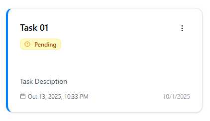

# 🚀 Task Manager - Full Stack Application

A modern, real-time task management application built with React.js frontend and Laravel backend, featuring a clean and intuitive user interface.

## 📋 Table of Contents

- [Features](#features)
- [Tech Stack](#tech-stack)
- [Installation](#installation)
- [Environment Variables](#environment-variables)
- [API Documentation](#api-documentation)
- [Screenshots](#screenshots)

## ✨ Features

### 🔐 Authentication
- **JWT-based authentication** with secure token management
- User registration with profile image upload
- Protected routes and API endpoints
- Secure logout with token removal

### 📝 Task Management
- **Full CRUD operations** for tasks (Create, Read, Update, Delete)
- **Real-time status updates** (Pending, In Progress, Completed)
- **Due date tracking** with overdue indicators
- **Dual view modes**: Grid and List views
- **Status filtering** and quick actions
- **Inline editing** with modal popups
- **Quick status changes** from dropdown menu

### 🔔 Notification System
- **Recent tasks dropdown** showing latest added tasks
- **Unread notification counter** with visual badge
- **Mark as read** functionality
- **Real-time updates** when new tasks are created

### 🎨 Modern UI/UX
- **Shadcn/ui components** for consistent design
- **Responsive design** for all devices
- **Smooth animations** and transitions
- **Clean, professional interface**
- **Intuitive navigation** and user flows

## 🛠 Tech Stack

### Frontend
- **React.js 18** with Vite
- **Shadcn/ui** - Modern component library
- **Tailwind CSS** - Utility-first CSS framework
- **Axios** - HTTP client for API calls
- **React Hook Form** - Form management and validation
- **Zod** - Schema validation
- **Lucide React** - Beautiful icons
- **React Router DOM** - Client-side routing

### Backend
- **Laravel 11** - PHP framework
- **MySQL** - Database
- **JWT Authentication** - Stateless auth
- **Laravel Sanctum** - API authentication

## 🚀 Installation

### Prerequisites
- Node.js 18+ 
- PHP 8.2+
- Composer
- MySQL
- Git

### Backend Setup (Laravel)

1. **Clone the repository**
```bash
git clone https://github.com/YoussoufEfkiren/ToDoList
cd backend
```
2. **Install dependencies**
```bash
composer install
```
3. **Environment configuration**
```bash
cp .env.example .env
php artisan key:generate
```
4. **Configure database**
```bash
Edit .env file:
```
```bash
env
DB_CONNECTION=mysql
DB_HOST=127.0.0.1
DB_PORT=3306
DB_DATABASE=task_manager
DB_USERNAME=root
DB_PASSWORD=
```

5. **Run migrations and seeders**
```bash
php artisan migrate
```
6. **Generate JWT secret**

```bash
php artisan jwt:secret
```
7. **Start the server**

```bash
php artisan serve
```
###  Frontend Setup (React)

1. **Navigate to frontend directory**

```bash
cd frontend
```
2. **Install dependencies**

```bash
npm install
```
3. **Start development server**

```bash
npm run dev
```
## Environment Variables

1. **Backend (.env)**
```bash
env
APP_NAME="Task Manager"
APP_ENV=local
APP_KEY=
APP_DEBUG=true
APP_URL=http://localhost:8000

DB_CONNECTION=mysql
DB_HOST=127.0.0.1
DB_PORT=3306
DB_DATABASE=task_manager
DB_USERNAME=root
DB_PASSWORD=

JWT_SECRET=your_jwt_secret_here
```
2. **Frontend (.env)**
```bash
VITE_API_URL=http://localhost:8000/api
```
## API Documentation

**Authentication Endpoints**
| Method | Endpoint           | Description       |  Body                                  |
|--------|--------------------|-------------------|----------------------------------------|
|  POST  | /api/auth/register | User registration | name, email, password, image(optional) |
|  POST  | /api/auth/login    | User login        | email, password                        |
|  POST  | /api/auth/logout   | User logout       | Bearer token                           |


**Task Endpoints**

| Method | Endpoint           | Description       |  Body                                  |
|--------|--------------------|-------------------|----------------------------------------|
|  GET   | /api/auth/register | User registration | name, email, password, image(optional) |
|  POST  | /api/auth/login    | User login        | email, password                        |
|  GET   | /api/auth/logout   | User logout       | Bearer token                           |
|  PUT   | /api/auth/register | User registration | name, email, password, image(optional) |
|  DELETE| /api/auth/login    | User login        | email, password                        |

### Request/Response Examples

**User Registration**

```bash
POST /api/auth/register
```
```json
{
  "name": "John Doe",
  "email": "john@example.com",
  "password": "password123",
  "password_confirmation": "password123"
}
```
```bash
Response:
```
```json
{
  "message": "User created successfully",
  "user": {
    "id": 1,
    "name": "John Doe",
    "email": "john@example.com"
  },
  "token": "jwt_token_here"
}
```
**Create Task**
```bash
POST /api/tasks
```
```json

{
  "title": "Complete project documentation",
  "description": "Write comprehensive documentation for the project",
  "status": "pending",
  "due_date": "2024-12-31 23:59:00"
}
```
```bash
Response:
```
```json
{
  "message": "Task created successfully",
  "task": {
    "id": 1,
    "title": "Complete project documentation",
    "description": "Write comprehensive documentation for the project",
    "status": "pending",
    "due_date": "2024-12-31T23:59:00.000000Z",
    "user_id": 1,
    "created_at": "2024-01-15T10:30:00.000000Z",
    "updated_at": "2024-01-15T10:30:00.000000Z"
  }
}
```
**Update Task Status**

```bash
PUT /api/tasks/1
```
```json
{
  "status": "completed"
}
```
```bash
Response:
```
```json
{
  "message": "Task updated successfully",
  "task": {
    "id": 1,
    "status": "completed",
    ...
  }
}
```
## Screenshots
**Authentication**

*Clean login interface with form validation*


*User registration with optional image upload*

**Dashboard & Task Management**


*Main dashboard with task statistics, filtering, and dual view modes*



*Grid view displaying tasks as cards with quick actions*


Task Operations

*Modal popup for creating new tasks with form validation*


*Dedicated page for editing task details*


*Confirmation modal for safe task deletion*

**Notifications**


*Dropdown showing recent tasks with unread indicators*

### Project Structure
```text
📦 task-manager/
├── 📂 backend/ (Laravel API)
│   ├── 📂 app/
│   │   ├── 📂 Models/
│   │   │   ├── User.php
│   │   │   └── Task.php
│   │   ├── 📂 Http/
│   │   │   ├── 📂 Controllers/
│   │   │   │   ├── AuthController.php
│   │   │   │   └── TaskController.php
│   │   │   └── 📂 Requests/
│   │   └── 📂 Events/
│   ├── 📂 database/
│   │   ├── 📂 migrations/
│   │   │   ├── create_users_table.php
│   │   │   └── create_tasks_table.php
│   │   └── 📂 seeders/
│   └── 📂 routes/
│       └── api.php
│
├── 📂 frontend/ (React Application)
│   ├── 📂 src/
│   │   ├── 📂 components/
│   │   │   ├── 📂 ui/ (Shadcn components)
│   │   │   │   ├── button.jsx
│   │   │   │   ├── card.jsx
│   │   │   │   ├── input.jsx
│   │   │   │   └── ...
│   │   │   ├── TaskForm.jsx
│   │   │   ├── TaskList.jsx
│   │   │   └── DeleteTaskDialog.jsx
│   │   ├── 📂 pages/
│   │   │   ├── Login.jsx
│   │   │   ├── Register.jsx
│   │   │   ├── Tasks.jsx
│   │   │   └── EditTask.jsx
│   │   ├── 📂 services/
│   │   │   └── api.js
│   │   ├── 📂 hooks/
│   │   └── 📂 lib/
│   └── 📂 public/
└── 📂 screenshots/
```

### Best Practices
```bash
Data Validation: Use Laravel Form Requests and Zod for React
```
```bash
Error Handling: Properly catch and display API errors
```
```bash
Security: Always validate user input and use JWT tokens
```
```bash
Performance: Optimize API requests and component rendering
```
```bash
UX: Provide visual feedback for all user actions
```
